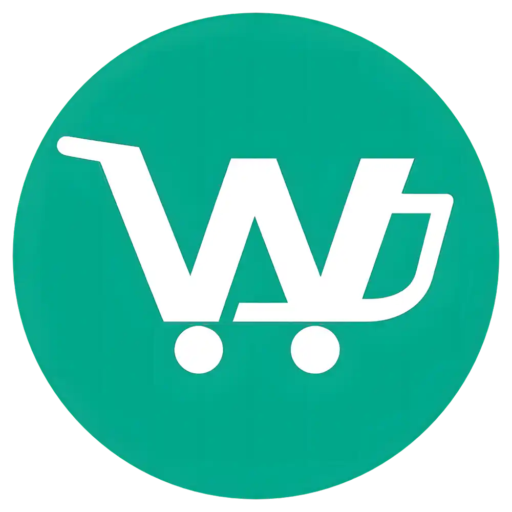
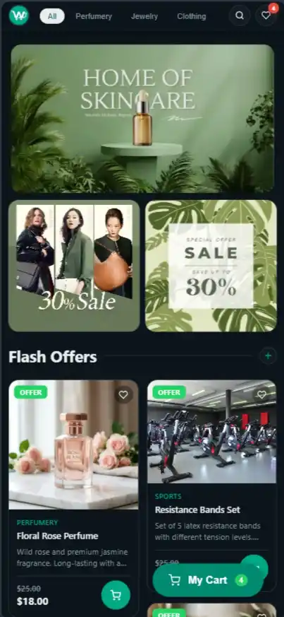
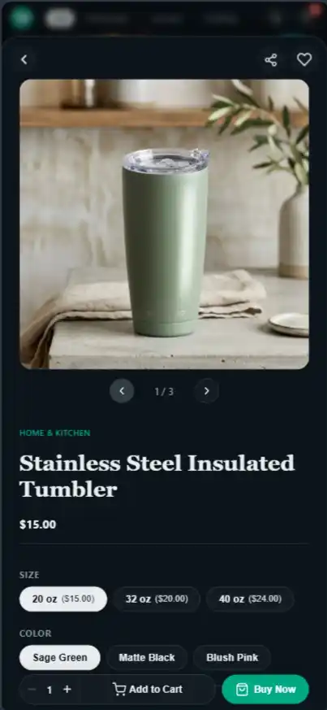
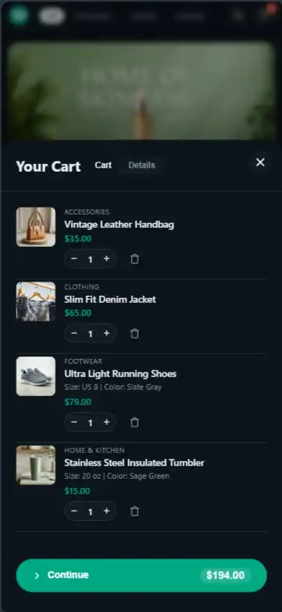
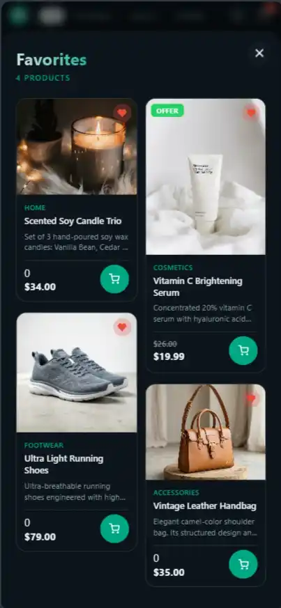
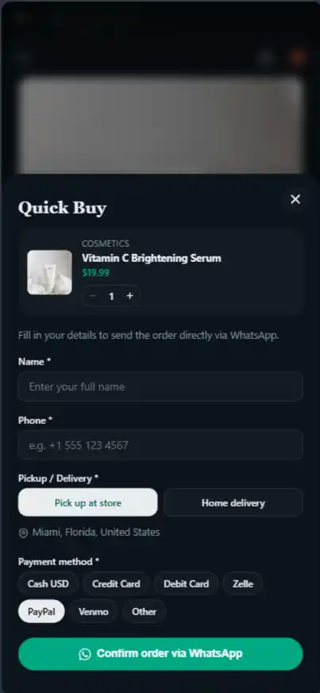
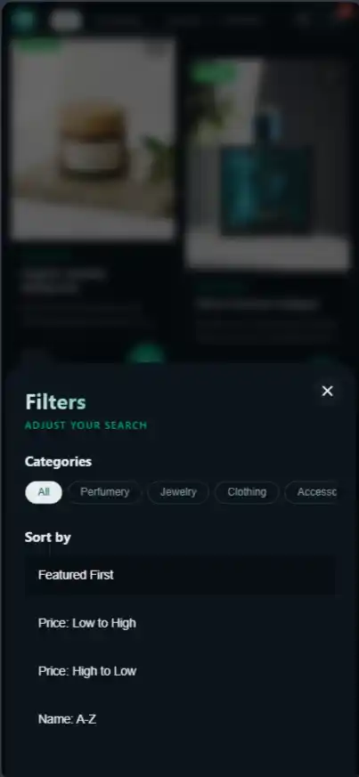

<p align="center"></p>

<h1 align="center">Whatalog — Online WhatsApp Catalog</h1>

<p align="center">
  <strong>From product list to WhatsApp order in one click. No backend, no database, no monthly fees.</strong>
</p>

<p align="center">
  Whatalog is a free, open-source Next.js template that turns Markdown files into a beautiful online store — installable as a PWA on any device. Your customers browse, add to cart, and send the complete order as a formatted WhatsApp message — directly from your site. Zero servers, zero databases, zero cost.
</p>

---

## Quick Start

```bash
npm install
npm run dev       # development at http://localhost:3000
npm run build     # production build
npm start         # run the built app
```

Deploy anywhere Node.js runs — Vercel, Netlify, Railway, or your own VPS. No extra configuration needed.

> Full documentation in [`GUIDE.md`](GUIDE.md).

---

## Why Whatalog?

<p align="center">
  
</p>

### Who is this for?

Small businesses, local shops, independent sellers, artisans, and entrepreneurs who need a professional online catalog without the complexity and cost of traditional e-commerce platforms. If you sell on WhatsApp or plan to, this is for you.

### Why not just use Instagram?

Instagram is great for reach, but it's a terrible storefront. Your products get buried in the feed, there's no cart, no organized catalog, no way for customers to browse and pick what they want without endless scrolling and screenshots. A customer has to see a post, comment "price?", wait for your reply, then manually send their order. It's friction at every step.

Whatalog gives your customers a real storefront — search products, filter by category, see prices clearly, add to cart, and send the complete order as one formatted WhatsApp message. No back-and-forth, no screenshots, no confusion.

### Why not Shopify, WooCommerce, or Mercado Shops?

Those platforms are powerful, but they come with baggage:

- **Monthly fees** that eat into your margins
- **Commission on every sale** if you use their payment gateways
- **Complex setup** — hosting, domains, payment processors, tax configurations
- **Abandoned carts** — the classic e-commerce problem. Customers browse, add items, then leave when asked to create an account or enter credit card details

With Whatalog there are no monthly fees, no commissions, no payment gateways, and no abandoned carts. The checkout is a WhatsApp message — your customer already has the app open, and they're one tap away from confirming their order.

### The WhatsApp advantage

WhatsApp is where your customers already are. They browse products on your site, build their cart, and send the order as a message. There's no account creation, no email verification, no credit card form. It's as natural as messaging a friend. Every order is a warm lead — someone who took the time to browse and build a cart is ready to buy.

### 100% free, forever

Whatalog is open source under the MIT license. You can use it, modify it, and distribute it freely. No hidden paid tiers, no "Pro version" with basic features locked away. What you see is what you get — and it's all yours.

---

## Screenshots

<div style="display: flex; justify-content: center; gap: 5px;">
  
  
  
  
  
  
</div>

---

## Features

| Feature                              | What it does                                                                                                                                                  |
| ------------------------------------ | ------------------------------------------------------------------------------------------------------------------------------------------------------------- |
| **Multi-format catalogs**      | Load products from Markdown (`.md`), Excel (`.xlsx`), CSV, or Google Sheets. All formats support variants and attributes.                                 |
| **CSS masonry grid**           | True Pinterest-style waterfall layout. Products look great at any aspect ratio — tall, square, or wide.                                                      |
| **Search & filters**           | Real-time search, category filtering, sort by price, name, or newest.                                                                                         |
| **PWA support**                | Installable as an app on Android and iOS. Service worker for offline-ready caching. Add-to-home-screen with custom icons, splash screen, and standalone mode. |
| **Smart cart**                 | Persists across sessions. Edit products from the cart, undo deletions with a 4-second timer, animated checkout steps with collapsible order summary.          |
| **WhatsApp checkout**          | One tap generates a complete, formatted order message with items, prices, and totals.                                                                         |
| **Popup navigation stack**     | Each popup tracks browser history. Tap back once per popup. Nested modals (Promo → Product → QuickBuy) stay properly stacked.                               |
| **Flash Offers section**       | Products with discounts appear in a dedicated masonry grid. A + button opens all offers in a full popup.                                                      |
| **Dark mode**                  | Automatic based on system preference. Fully customizable via CSS variables.                                                                                   |
| **Promo groups**               | Group 2–4 products into promo modals that open from banner images.                                                                                           |
| **Browser-native translation** | UI is in English; visitors use their browser's built-in translate to view it in any language.                                                                 |

---

## Customize

Edit `content/store-config.json` to set your store name, phone number, currency, promo banners, and social links. Add products as `.md` files in `content/products/` or edit the Excel/CSV catalog sheets. Swap `logo.webp` for your own logo. Adjust colors and fonts in `app/globals.css`.

No code changes needed for the basics — just configuration files and content.

---

## Support

If Whatalog has helped you launch your store or saved you time, consider [buying me a coffee](https://tppay.me/mquz2zh8). Every contribution helps keep the project free, maintained, and improving.

---

## License

[MIT](LICENSE) — free to use, modify, and distribute. No strings attached.

---

<p align="center">
  <strong>Made with ❤️‍🔥 by <a href="https://1azarito.vercel.app">1azarito</a>
